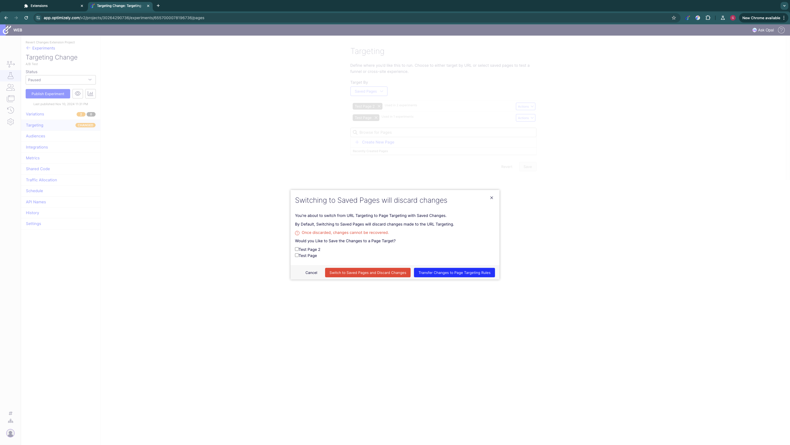
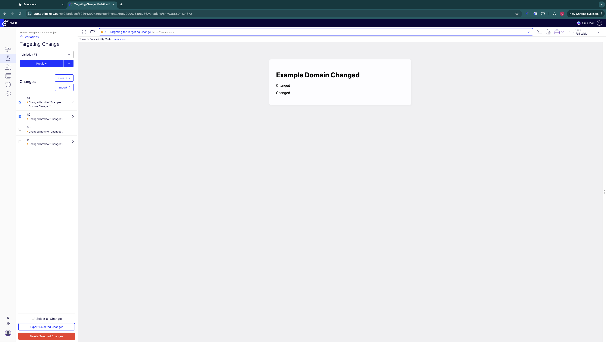
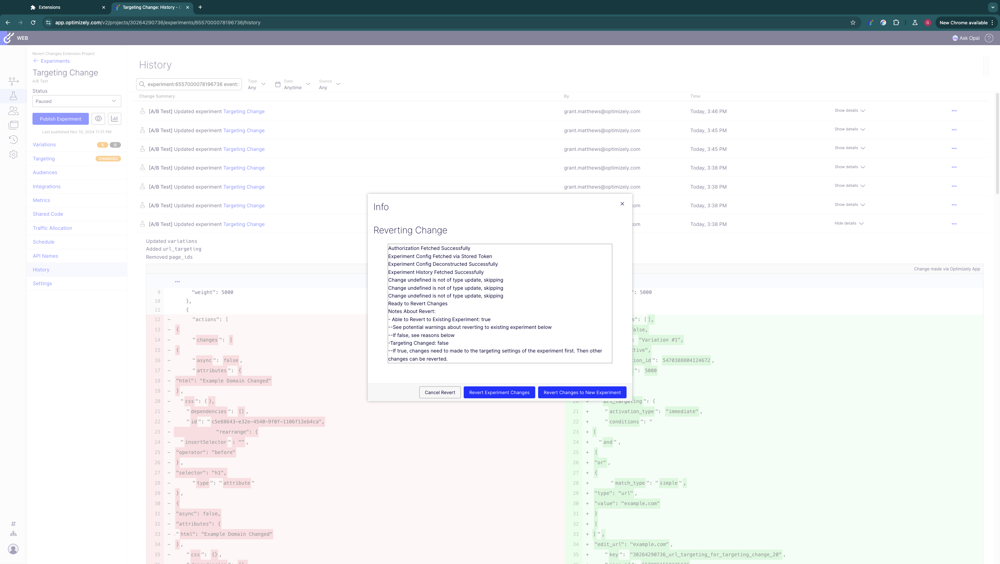
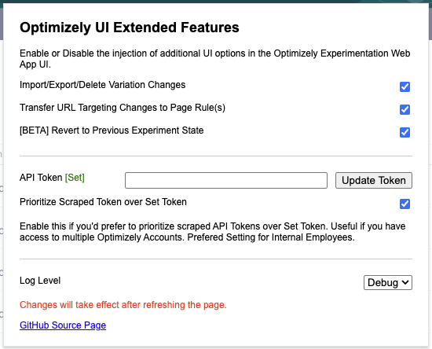

# Optimizely UI Extended

## Welcome!

This project was concieved after some discussion with the Optimizely Experimentation Application Support Team about what features were missing from the current Optimizely Experimentation UI that would be useful to have. This extension's goal isn't to provide fixes for existing features, but rather as a tool to add functionality and gauge feature interest to pass on to engineering for permanent implementation in the application.

If you have any feedback about the extension or would like to request new UI features, please create a GitHub issue or fork this repository and add the feature yourself.

## Installation

The extension is hosted on the Chrome App store. The extension ***should*** also be compatible with any Chromium based browser (Edge, Arc Brave, etc) however your mileage may vary.

To install the extension, visit the Chrome App Store and install the extension: [LINK]

Alternatively, the extension can be installed as an unpacked extension by downloading and extracting the latest GitHub release and loading the `/extension` directory as an unpacked extension from your browser's extension settings.

## API Usage

This extension relies on the [Optimizely Experimentation REST API](https://docs.developers.optimizely.com/web-experimentation/reference/overview) to function (much like the existing Web App) . Use of the API relies on a [Personal Access Token](https://docs.developers.optimizely.com/web-experimentation/docs/personal-access-token) (PAToken). PATokens are scoped to a user and can be used for any API functions that the user has access to based on their assigned [Collaborator Role](https://support.optimizely.com/hc/en-us/articles/4410289793037-Manage-collaborators) for a given project. 

In general, users with the Collaborator Role of **Publisher** or higher will benefit from this extension. Most of the extensions features cannot be used by users with lower permissions. Your mileage may vary.

This extension collects PAToken(s) in one of two ways:

* In the extension's menu, you can set a PAToken generated from the Optimizely UI. [Instructions for generating a PAToken](https://docs.developers.optimizely.com/web-experimentation/docs/personal-access-token#generate-a-token). This has the advantage of always being available to the extension (after being set). However, PATokens only apply to a single Optimizely Experimentation Account. If you have access to multiple Optimizely Experimentation Accounts and switch between them, you will need to update this token each time you move between accounts.
* The extension also scrapes your current application session for the PAToken that is automatically generated when you log into the Web App. This has the advantage of always being the correct token for your current logged in session and account. However, the Web App UI makes the session PAToken available inconsistently so its possible the extension hasn't been able to scrape a PAToken in certain cases.

In the extension's menu, you can enable the option to Prioritize Scraped Token. With this enabled, the extension will first try to use the PAToken scraped from the UI (if it exists). If this token doesn't exist or fails, the extension will attempt to use the stored token as a back up. **Generally, its recommended to keep this setting enabled as the extension is usually able to scrape a PAToken before it needs one.** If you only access a single Optimizely Account, this setting can be disabled after setting a PAToken in the extension's settings.

## Features

The extension currently has 3 UI enhancements, each able to be enabled/disabled via the extension's settings menu.

### Transfer Changes (When Switching from URL Targeting to Page Targeting)

Currently when an experiment with changes using URL Targeting is switched to Page Rule(s) targeting, the existing changes created in the URL Targeting page are lost forever. 

When this feature is enabled, a prompt is added before the user changes an experiment (with changes) from URL Targeting to Page Rule(s) targeting. The prompt allows the user to transfer the changes on the URL Targeting Page to any of the Page Rule(s) the experiment targeting is being changed to. The URL Targeting changes can be applied to any combination of the Page Rule(s) the experiment targeting is being changed to.

##### Notes

* The popup will **only** appear if the user is transfering targeting from URL Targeting to Page Rule Targeting, and the existing URL Targeting Rule has changes.
* Changes from all Variations will be transfered.

### Import, Export and Delete Changes

Currently there is no way mass edit the changes made in an experiment variation. Changes must be created or deleted one at a time and cannot be backed up or moved to another experiment or variation.

With this feature enabled, additional options are added to the visual editor that allow the user to Import a list of changes or select and export or delete any existing changes in the variation. 

### [Beta] Revert Experiment to Previous State

Currently when a change is made to a web experiment, the change is perminant and there is no way to undo back to a previous experiment state. Experiments do have a History object that contains a list of changes, however this list isn't easily human readable and cannot currently be used to revert changes.

With this feature enabled, additional options are added to an experiment's history page that allow you to select a change to revert back to. When a change is selected, the extension will attempt to revert the experiment's state back to how it was before the selected change. The extension does this by working backwards through the experiment's history and attempting to undo each change individually until it reaches the desired change.

After working backwards, the extension allows you to take the reverted experiment state and apply it to either the current experiment or create a new experiment. Some changes cannot be reverted and in that case, it will only be possible to create a new experiment.

##### **Disclaimers:**

* There are a lot of different types of change an experiment can go through. Some of these changes (like integration settings) aren't reported in the change history. This means these changes will not be reverted.
* I have done my best to account for every possible experiment state change, however I may have missed something.

## Extension Settings

The Extension's settings can be found by opening the extension's menu from your browser extension menu. 

### Enable Features

Each of the extensions features can be enabled or disabled from here. As new UI features are added, they will be made available here.

### API Token Settings

Here you can set a stored PAToken and enable or disable the prioritization of scraped tokens. For more information see API Usage sections of docs.

### Log Level

The extension has five log levels:

* `off` - No logs are produced in the page console
* `error` - Error logs are produced in the page console
* `info` - Some messages indicating extension function and errors are produced in the page console
* `debug` - Every action conducted by the extension and all errors is produced in the page console.
* `all` - All logs from the extension are shown. Some of these are produced many times repeatedly.
